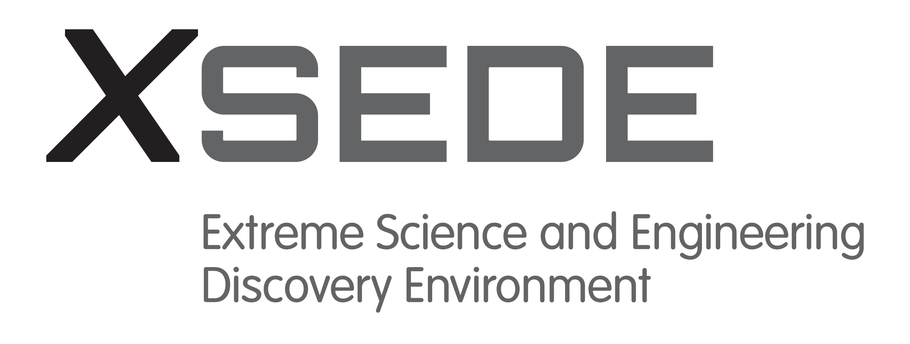

# Assessment of methods for Transposon Insertion Sequencing(TIS) analyses

Transposon Insertion Sequencing Analyses using Galaxy, BioConda and public research infrastructure (XSEDE, de.NBI-cloud, ARDC cloud)

[Delphine Larivière](https://github.com/Delphine-L),
[Anton Nekrutenko](https://github.com/nekrut)

This repo serves as a companion to our study assessing the computational tools for Transposon Insertion Sequencing analyses:

> [Assessment of computational tools for analysis of essential genes in bacterial genomes](https://doi.org/) Delphine Larivière, Laura Wickham, Kenneth Keiler, Anton Nekrutenko doi: https://doi.org/

It contains descriptions of workflows and exact versions of all software used. The goals of this study were to:

 1. Identify the methods used for TIS analyses in the litterature
 2. Identify the best ones to use for the two most common types of TIS data
 3. Implement robust and accessible analyses workflows for these two types of data

Our analysis was divided into two parts listed below. Each part has a dedicated page that provides links to input datasets, intermediate and final results, workflows, and Galaxy histories that list all details for each analysis. These workflows can be re-run by any of three global Galaxy instances in the [US](http://usegalaxy.org), in [Europe](http://usegalaxy.eu) and in [Australia](https://usegalaxy.org.au).

  1. [Tradis Data](1-TraDis)
  2. [TnSeq Data](2-TnSeq)

 The analyses have been performed using the [Galaxy](http://galaxyproject.org) platform and open source tools from [BioConda](https://bioconda.github.io/). Tool runs used [XSEDE](https://www.xsede.org/) resources maintained by the Texas Advanced Computing Center ([TACC](https://www.tacc.utexas.edu/)), Pittsburgh Supercomputing Center ([PSC](https://www.psc.edu/)), and [Indiana University](https://jetstream-cloud.org/) in the U.S., [de.NBI](https://www.denbi.de/) and [VSC](https://www.vscentrum.be) cloud resources on the European side, and [ARDC](https://ardc.edu.au) cloud resources in Australia.

 Powered by: 
 
 
 

 

   &nbsp;
   &nbsp;
   &nbsp;
   &nbsp;
   &nbsp;
   &nbsp;
  

